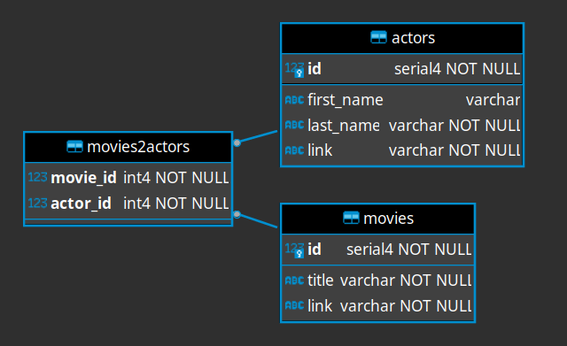

# movie_app

Application is using flask web framework, sqlalchemy db for and click for command-line interface.
It uses postgres as database. 

## 1. Requirements

**python >=3.8**  
**docker**  

Two db instances are needed - default port configuration is: 
* 4432 (for app)
* 4442 (for testing)


optional requirement:  
**vagrant**
    
## 2. Installation
Installation can be performed on local machine or in virtual machine. 

### 2.1 Vritual machine installation
Suggested way to use VM is [vagrant](https://learn.hashicorp.com/tutorials/vagrant/getting-started-install?in=vagrant/getting-started).

Get vagrant file:  
`wget -O Vagrantfile https://raw.githubusercontent.com/sakalosj/movie_app/main/Vagrantfile`

setup VM:  
`vagrant up`

connect to VM:  
`vagrant ssh`


### 2.2 Application installation
To install application on both local machine or in vm execute following commands:

```
git clone https://github.com/sakalosj/movie_app.git  
cd movie_app
make install
make db_start
. venv/bin/activate
movie_app_cli initdb
```

### 3. Configuration
Default configuration location is:  
* `./data/movie_app.yaml` for app  
* `./tests/data/test_movie_app.yaml` for tests

configuration location can be changed by setting env variable `MOVIE_CFG`

### 4. Runnig app
To start application execute:
```
. venv/bin/activate
movie_app_cli import-web-data
make web_start
```

### 5. running tests
To start test execute:
```
. venv/bin/activate
make test_db_start
make unit_tests
make integration_tests 
```

### Appendix: db diagram
